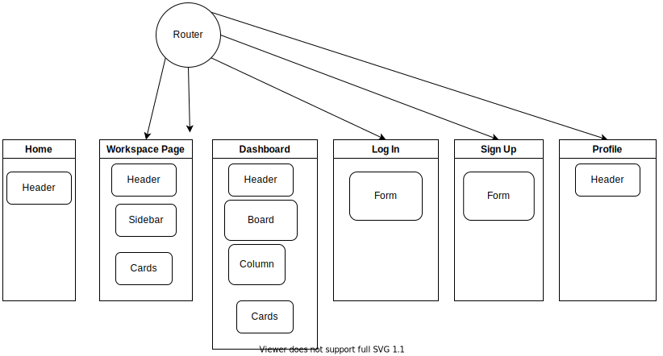

# Job Application Tracker - Front End

An app that uses React JS for the front end and Ruby on Rails API for the backend.
This repository is the front end of the app.

---

## Version
 - React v18.2.0
 - TailwindCSS v3.1.8
 - React Router v6.4.1
 - Typescript v4.8.4

## Setup
```
$ npm start
```


# Components and Pages


# Features
- User can Log In
- User can Sign Up
- User can create, read, update, delete Workspaces
- User can create, read, update, delete Job Applications

# Tools Used
- React Router
- Axios
- Typescript
- Tailwind CSS

# Pages Implemented
- [x] Homepage
- [x] Workspace
- [x] Dashboard
- [x] Log In
- [x] Sign Up
- [ ] Profile

# Projects Link
- Board: [Visit the link to see the progress of this project](https://github.com/users/jocogum10/projects/3/views/1).
- API: [Visit the link to see the progress of the API used](https://github.com/jocogum10/job-application-tracker-api)

# UI

### Login


### Sign up


### Home Page


### Workspace Page


### Dashboard Page
